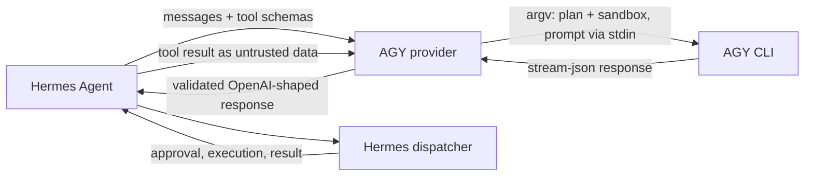

# Hermes AGY provider plugin

This repository adds two Hermes Agent model-provider profiles for the AGY CLI:
**AGY** (high effort) and **AGY Fast** (low effort). Hermes remains the owner of
the conversation state, tool schemas, approvals, execution, logs, and tool
results. AGY is a bounded text-only reasoning subprocess.

## Security model

The provider always starts AGY with `--mode plan --sandbox` and disables slash
commands. It passes no shell command string: every option is an argv element.
The prompt itself is never an argument: it is written to AGY's stdin as one
`--input-format stream-json` user message, so large conversations are not
limited by the operating system's per-argument size cap (128 KiB on Linux).
The child receives a small operating-system environment allowlist. Credential
variables, including `GOOGLE_*`, `GEMINI_*`, and `AGY_*`, are not forwarded
automatically. If an AGY installation needs a particular variable, pass its
name explicitly with `HERMES_AGY_ENV_ALLOWLIST=NAME1,NAME2`.

AGY cannot execute Hermes tools directly. Tool schemas are rendered into a
delimited prompt by Hermes' public ACP bridge. The response is accepted only
after the plugin validates the NDJSON envelope, tool name, call ID, exact JSON
shape, argument object, size, duplicates, and `tool_choice`. A blocked AGY
action gets one bounded retry with a generic instruction; a second denial
fails closed and lets Hermes' normal fallback handle it.

Write mode is deliberately rejected, including inside a Git worktree. Allowing
AGY's own edit tools would bypass Hermes approval gates and violate the host
ownership model. Writes must be requested as Hermes tool calls.



## Persistent AGY sessions (prototype)

By default every request starts a new AGY process. Setting
`HERMES_AGY_PERSISTENT=1` keeps finished AGY processes in a small in-memory
pool instead, one per Hermes session. Only requests from the agent loop carry
a session id (passed through `build_api_kwargs_extras`); auxiliary requests such
as titles, compression, and session search never do, so they stay on one-shot
processes. A request reuses an idle process only when its messages are an
unchanged continuation of the conversation that process already holds: the
previous request's messages match exactly, the next message is the assistant
reply with the same tool-call IDs, and no new system message follows. Only the
new messages are then sent to AGY.

Anything else starts a fresh process: an edited or compressed history, a
different model, effort, tool list, command, working directory or environment,
or a new system message. A process is discarded, never reused, after a timeout,
exit, oversized output, protocol error, or two denied actions, because AGY keeps
running an unfinished turn and would merge it into the next one. The provider
enforces its own turn deadline, so AGY's `--print-timeout` is set to one day.

| Variable | Default | Meaning |
| --- | --- | --- |
| `HERMES_AGY_PERSISTENT` | off | enable the pool |
| `HERMES_AGY_SESSION_IDLE_SECONDS` | `900` | kill a process idle this long |
| `HERMES_AGY_MAX_SESSIONS` | `4` | idle processes kept; the least recently used goes first |

When a session cannot continue in its process, that process is stopped at once
rather than left idle.

Each request logs `AGY session reused (turn N): …` or
`AGY session started (<reason>)` at INFO level, which shows how often reuse
actually happens. Idle processes exit on their own when Hermes exits, because
their stdin closes.

## Reasoning effort

AGY accepts `low`, `medium`, and `high`. The **AGY** profile defaults to `high`
and **AGY Fast** to `low`. When Hermes sends a reasoning effort, it is mapped
per request: `minimal`/`low` → `low`, `medium` → `medium`,
`high`/`xhigh`/`max`/`ultra` → `high`, and reasoning turned off → `low`.

## Requirements and compatibility

- Hermes Agent **0.21.2 or newer**, including `ProviderProfile.create_client`
  and `agent.acp_openai_bridge`;
- AGY CLI installed and authenticated using its upstream instructions;
- Python 3.11 or newer.

The implementation was exercised against the public Hermes 0.21.2 source and
AGY CLI 1.2.2's documented command-line interface (`agy --version` and
`agy --help`). CI never logs in to Gemini and never requires a live AGY call.

The model defaults are `gemini-3.8-flash-high` and
`gemini-3.8-flash-low`. They are passed through unchanged, so an AGY release
with different model aliases can select those names explicitly in Hermes.

## Installation

From a checkout:

```bash
git clone https://github.com/tomaasz/hermes-agy-plugin.git
mkdir -p ~/.hermes/plugins/model-providers
cp -R hermes-agy-plugin/plugins/model-providers/agy \
  ~/.hermes/plugins/model-providers/agy
```

Hermes' plugin installer can also install the repository into its normal
`$HERMES_HOME/plugins/` directory. Restart Hermes or start a new session after
installing so provider discovery runs again.

Select a profile in a new session:

```text
/model gemini-3.8-flash-high --provider agy
/model gemini-3.8-flash-low --provider agy-fast
```

For a wrapper executable, set `HERMES_AGY_COMMAND` or `AGY_CLI_PATH`. The
wrapper must be directly executable and contain any fixed arguments itself.
Additional process arguments are rejected because even a positional argument
could select an AGY subcommand before the sandbox and plan-mode flags.

## Request flow and fallback

The provider starts one AGY process per Hermes completion. It accepts exactly
one `event=result` object in `stream-json`; malformed lines, missing or
multiple result events, empty responses, non-zero exits, output over 8 MiB,
invalid UTF-8, and timeouts are errors. The request timeout covers the initial
attempt and the optional denial retry together. A timeout sends SIGTERM, waits
briefly, then sends SIGKILL if needed. Closing the client stops every active
child. Stderr is bounded and secrets in diagnostics are redacted.

`stream=True` returns the standard two-chunk OpenAI-compatible shape used by
Hermes: a data chunk followed by a usage chunk. Usage is mapped from either
`prompt_tokens`/`completion_tokens` or `input_tokens`/`output_tokens` when AGY
provides it.

If AGY returns a denied internal action, the plugin retries once. The retry
does not echo the action name or any AGY output. A second denial raises a
provider error, allowing Hermes' configured provider fallback to take over.

## Development and tests

The suite uses a real subprocess stub, never a live model:

```bash
python -m pytest -q -o 'addopts=' tests/test_agy_provider.py
python -m py_compile plugins/model-providers/agy/__init__.py \
  plugins/model-providers/agy/client.py
ruff check plugins tests
ruff format --check plugins tests
git diff --check
```

Tests cover both profiles, model/effort forwarding, read-only flags, write
rejection, schema forwarding, valid and multiple calls, malformed wrappers and
JSON, missing or duplicate IDs, unknown tools, argument and prompt limits,
`tool_choice` modes, empty/partial/multiple-result streams, split Unicode
NDJSON, usage, process failures, redaction, timeout cleanup, denied retries,
environment isolation, shell-injection resistance, and prompt-injection
attempts in tool results. They also verify a shared retry deadline, invalid
UTF-8 rejection, and cleanup of concurrent subprocesses.

## Troubleshooting

- **Provider is missing:** verify Hermes is 0.21.2+ and that the directory is
  under `$HERMES_HOME/plugins/model-providers/agy`; restart the session.
- **CLI not found:** run `agy --version`, then set `AGY_CLI_PATH` to the
  executable selected by your installation.
- **Authentication failure:** authenticate AGY with its upstream CLI. Hermes
  does not read or store AGY credentials.
- **Timeout or output-limit error:** use a smaller request or configure the
  provider timeout in Hermes; inspect the AGY CLI independently with a simple
  non-interactive prompt.
- **Tool call rejected:** the call must use exactly
  `<tool_call>{"id":"...","type":"function","function":{"name":"...","arguments":"{...}"}}</tool_call>`
  and the name must be one of the Hermes schemas in that turn.

## Limitations

AGY is text-only in this adapter; image content is represented by a placeholder.
There is no live model catalog, parallel subprocess mode, telemetry, or
automatic credential forwarding. The adapter does not modify Hermes core and
does not grant AGY a terminal, filesystem, browser, network, or independent
tool executor.

## Reporting problems

Please include the Hermes version, AGY version, selected profile, sanitized
error text, and a minimal reproducible stream-json fixture. Never include
tokens, cookies, credentials, private paths, or full tool-result contents.

## License

MIT. See [LICENSE](LICENSE).
