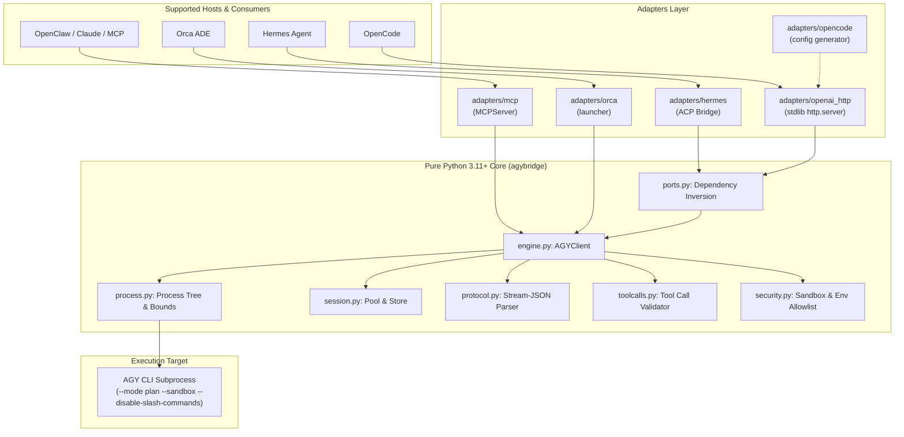

# agybridge

Universal, modular cross-platform reasoning bridge for the **AGY CLI** (Antigravity).

`agybridge` decouples the external bounded AGY subprocess reasoning engine from specific host environments, exposing high-effort and low-effort reasoning capabilities to:

1. **Hermes Agent** – full backward compatibility via native model-provider shims,
2. **OpenCode** – via a lightweight, zero-dependency local OpenAI-compatible HTTP server (`@opencode/ai/providers/openai-compatible`),
3. **OpenClaw & any MCP Host** – via a universal Model Context Protocol (MCP) server exposing the `agy_reason` tool,
4. **Orca ADE** – via an executable CLI wrapper (`agy-bridge-agent`) and Docker container variant.

---

## Platform Support Matrix

| Platform / Host    | Integration Type                                       | Key Capabilities                                                                                           |
| ------------------ | ------------------------------------------------------ | ---------------------------------------------------------------------------------------------------------- |
| **Hermes Agent**   | Native Provider Plugin (`plugins/model-providers/agy`) | Profiles `agy` (high) & `agy-fast` (low), strict tool bridging, persistent session pool, restart store     |
| **OpenCode**       | OpenAI HTTP (`/v1/chat/completions`, `/v1/models`)     | Non-streaming & SSE streaming, bearer token auth, payload limit 8 MiB, session mapping via `X-AGY-Session` |
| **OpenClaw / MCP** | Universal MCP Server (`agybridge mcp`)                 | Tool `agy_reason(prompt, effort, model, session_id)`, `stdio` and streamable SSE transport                 |
| **Orca ADE**       | Executable CLI Agent Wrapper & Docker                  | Directly executable script `agy-bridge-agent`, containerized HTTP daemon                                   |

---

## Architecture



---

## Security and Sandbox Guarantees

As documented in [`docs/AUDIT.md`](docs/AUDIT.md), `agybridge` enforces strict security invariants across all adapters:

1. **Subprocess Sandboxing:**
   - Always launched with `--mode plan --sandbox --disable-slash-commands`.
   - Never invoked through a shell (`shell=False`); strict argv list only.
   - User prompts are fed solely through stdin (`--input-format stream-json`), bypassing the operating system per-argument size cap (128 KiB on Linux).
2. **Environment Isolation:**
   - Child processes receive a minimal allowlist (`PATH`, `HOME`, `LANG`, etc.).
   - Credential variables (including `GOOGLE_*`, `GEMINI_*`, `AGY_*`) are NEVER forwarded automatically. Extra variables require explicit configuration via `HERMES_AGY_ENV_ALLOWLIST`.
3. **Secret Redaction:**
   - Diagnostic stderr output is scrubbed of API keys, bearer tokens, and credentials before logging or inclusion in exception messages.
4. **Memory and Size Bounds:**
   - Maximum stdout buffer: 8 MiB (fail-closed overflow detection).
   - Maximum stderr buffer: 64 KiB tail buffer.
   - Maximum prompt size: 4 MiB.
   - Maximum tool argument size: 64 KiB.
   - Maximum tool calls per turn: 16.
5. **Zero-Dependency HTTP Server:**
   - Implemented using standard library `http.server.ThreadingHTTPServer`.
   - Binds strictly to `127.0.0.1` by default.
   - Requires `Authorization: Bearer <token>`.
   - Enforces 8 MiB hard limit on request body (`413 Payload Too Large`).
   - Disallows CORS headers.

---

## Installation

### Standard Installation

```bash
git clone https://github.com/tomaasz/agybridge.git
cd agybridge
pip install .
```

### With MCP Support

```bash
pip install .[mcp]
```

### Hermes Agent Native Plugin Installation

Copy or symlink the plugin into your Hermes installation:

```bash
mkdir -p ~/.hermes/plugins/model-providers
cp -R plugins/model-providers/agy ~/.hermes/plugins/model-providers/agy
```

Existing configurations and profiles (`agy`, `agy-fast`) remain 100% backward compatible without changes.

---

## CLI Usage

The package installs the `agybridge` CLI executable:

### 1. Run OpenAI-Compatible HTTP Server (for OpenCode)

```bash
# Start server on default 127.0.0.1:8791 with token authentication
agybridge serve --port 8791 --token my-secret-token

# Or configure via environment variable
export AGYBRIDGE_TOKEN="my-secret-token"
agybridge serve
```

Generate OpenCode configuration snippet:

```bash
agybridge config opencode --base-url http://127.0.0.1:8791/v1 --token my-secret-token
```

### 2. Run MCP Server (for OpenClaw / Claude Desktop)

```bash
# Run over standard I/O (default)
agybridge mcp

# Run over SSE transport
agybridge mcp --transport sse --port 8792
```

### 3. Install Orca ADE Agent Wrapper

```bash
agybridge orca install
# Installs directly executable wrapper to ~/.local/bin/agy-bridge-agent
```

---

## Persistent Sessions and Resumption

When `HERMES_AGY_PERSISTENT=1` (or `X-AGY-Session` header is provided in HTTP requests):

- Completed AGY processes are kept in an idle pool (up to `HERMES_AGY_MAX_SESSIONS`, default: 4).
- Subsequent requests with matching history continue in the existing process, sending only conversation deltas.
- On process restart or gateway reboot, resumable AGY conversation IDs are recovered from `~/.hermes/state/agy-conversations.json` (SHA-256 history digest, no raw message contents).
- With `HERMES_AGY_WARM_SPARE=1`, one pre-started AGY process per model/effort waits for the next new conversation (or restart after context compression) or one-shot request (e.g. Hermes auxiliary tasks). A one-shot request uses the spare once and discards it, so nothing carries over between unrelated requests. This skips AGY's launch time (measured 3.9 s → 1.8 s for a one-shot reply). Each spare is an idle AGY process (~200 MB plus any MCP servers AGY starts) and expires with the idle timeout.
- Slow AGY turns (~18 s each) are usually MCP servers that fail to connect: AGY waits for them before every turn and ignores `"disabled": true`, so remove them with `agy mcp remove <name>`.
- A spent AGY quota fails fast: AGY retries a quota 429 with growing backoff (about 3 minutes in one-shot mode) and only writes the reason to its log, so each AGY process gets its own `--log-file` (in `~/.gemini/antigravity-cli/log/agybridge-*.log`, newest 50 kept; override with `HERMES_AGY_LOG_DIR`). As soon as the log shows `RESOURCE_EXHAUSTED … quota`, the bridge stops AGY and raises `AGYQuotaError` (a subclass of `AGYProcessError`, so Hermes falls back as before) with AGY's message, e.g. `Resets in 93h56m`. The HTTP server answers 429 `insufficient_quota`. Measured on an exhausted account: 186 s → 5 s. A plain rate-limit 429 without "quota" is still left to AGY's retries.
- A spent quota is remembered until it resets: AGY's message says when (e.g. `Resets in 93h56m`), so the bridge records it per model (effort variants share it) in `~/.hermes/state/agy-quota.json`, shared by every process on the host, and answers at once with `AGYQuotaError` instead of launching AGY. One request per `HERMES_AGY_QUOTA_PROBE_SECONDS` (default 900) still goes through, so logging into another account or buying more quota is picked up without waiting for the reset; a success clears the record. `agybridge quota` shows the records, `agybridge quota --clear` forgets them, `HERMES_AGY_QUOTA_STATE=off` disables remembering. The HTTP server adds `Retry-After`.
- Google accounts from the agent-lb pool: with `AGENT_LB_URL` and `AGENT_LB_API_KEY` (or the same lines in `~/.config/agybridge/agybridge.env`, written by agent-lb's `agy-setup.sh --key`), the bridge asks agent-lb which Google account this station uses (every 5 min) and installs its token as AGY's login (`~/.gemini/jetski-standalone-oauth-token`; the previous local login is kept as `.bak-agybridge`). On a spent quota it reports the account to agent-lb, gets the next one and retries the request (up to 3 accounts). Sessions, stored conversations and quota records are kept per account. Accounts are logged in and ordered in the agent-lb dashboard (Accounts → AGY). Without these settings AGY keeps using the account logged in with `agy`.
- Every request logs its wall time and the model's own duration, e.g. `AGY request done in 2.2s (session turn 9; model 2.1s, 275372 prompt tokens)`. (AGY's `duration_seconds` counts from the start of the conversation, so it is not logged.)

---

## Testing and Verification

Run the test suite (74 tests covering baseline regression, core modules, HTTP server, MCP, and integrations):

```bash
pytest -v
```

Verification covers:

- Untouched baseline regression test suite (`tests/test_agy_provider.py`, 37 tests),
- Backward-compatibility import shims (`tests/test_backcompat_imports.py`),
- Core execution, process tree SIGTERM/SIGKILL, buffer limits, and security allowlists (`tests/core/`),
- OpenAI HTTP streaming SSE, auth gates, 8 MiB limits, and Hermes-HTTP response parity (`tests/adapters/test_openai_http.py`),
- MCP tool definition and execution (`tests/adapters/test_mcp.py`),
- OpenCode config generator and Orca launcher (`tests/adapters/test_opencode.py`, `tests/adapters/test_orca.py`).

---

## License

MIT. See [LICENSE](LICENSE).
